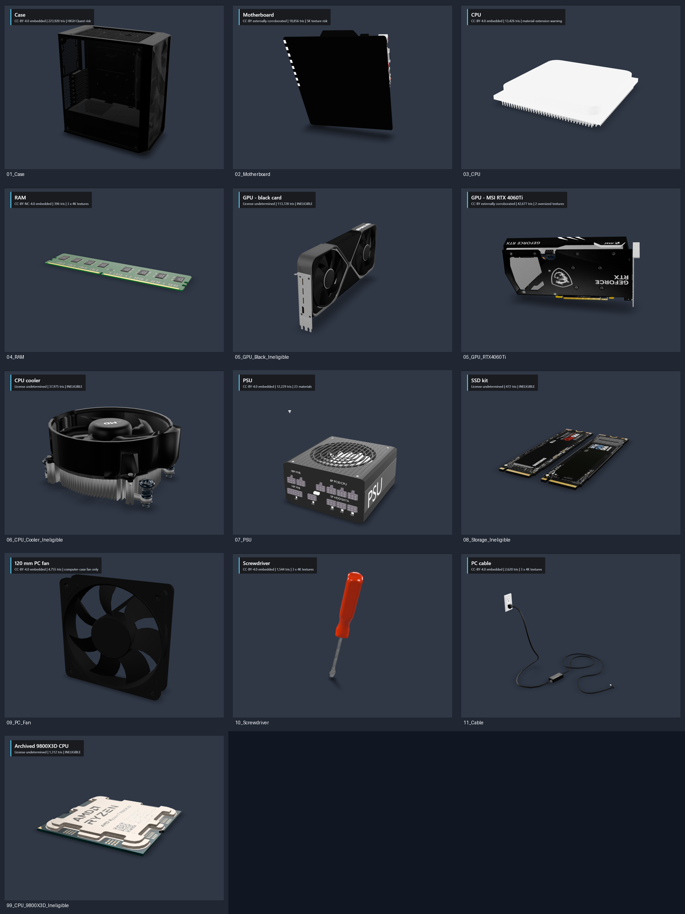

# ITEM_3D Model Audit

> **Superseded in part.** The integration this audit closes on was rejected on
> 2026-08-04 for overcrowding, overlapping and floating parts, inconsistent scale and
> unclear tool/spare areas. Several selections below were revised once the models were
> measured inside Unity rather than parsed from GLB JSON: the RTX 4060 Ti is rejected
> (its backplate is 26.5 x 2.49, about 10.6:1, where a real card is nearer 2.2:1), the
> storage kit is two M.2 drives rather than one 2.5" drive, and the power supply's axes
> are width/depth/height. See `Verification/ITEM_3D_REBUILD_RECORD.md` for the corrected
> decisions, and `ITEM_3D_REBUILD_COMPARISON.md` for before/after captures. The licence
> findings in this document stand unchanged.

**Audit date:** 2026-08-03 (Asia/Bangkok)  
**Source library:** `D:\ITEM_3D`  
**Pre-import checkpoint:** `22c71580d67760a1595f570f59747815474b0299` (`Checkpoint Quest readability before model integration`)  
**State at report close:** controlled import, wrapper-preserving integration, two source rebuild/validator passes, available Play Mode checks, screenshot capture, and internal visual QA complete.

## Gate result

**CLEARED with exclusions.** Unity Package Manager installed official `com.unity.cloud.gltfast@6.19.0`, and Unity imported every selected GLB through `GLTFast.Editor.GltfImporter`. Exact title and triangle-count matches on the original Sketchfab records resolved the cooler, SSD, motherboard, and both GPU licenses. The 223,920-triangle case remains rejected, the downloaded wall-power cable remains unsuitable for the ATX fault, and the 120 mm fan remains Computer-only.

The imported originals are unchanged. Motherboard, RAM, RTX GPU, and screwdriver use separately hashed texture-capped derivatives with every embedded raster image at or below 2048 px.

## Preview evidence

The preview set was rendered directly from local GLB files in an isolated browser viewer; it was not imported into Unity and does not prove Unity material compatibility.

Individual captures are in `Assets/VRMaintenanceResearch/Docs/Screenshots/ITEM_3D_Previews/`. The renderer was pinned to `@google/model-viewer@4.1.0`. The CPU preview emitted an unsupported `KHR_materials_pbrSpecularGlossiness` warning; the motherboard rendered mostly black; the RTX 4060Ti opened with a rotated orientation. These are import/material/orientation risks, not scene changes.

### Independent fresh-eyes visual QA

This is internal AI visual QA, not human-pilot data. Visible-only review found:

- RAM, PSU, screwdriver, the black dual-fan GPU, and the storage kit have the clearest immediate silhouettes. Exact public model matches later resolved the black GPU and storage licenses; the black GPU was still rejected for its 113,728-triangle cost.
- The motherboard is nearly an unreadable black slab in the neutral preview; it needs a successful Unity material conversion before selection can be confirmed.
- The RTX 4060Ti reads as a GPU but needs rotation correction.
- The cable reads as a wall-power cord with an inline block, not a 24-pin ATX loom.
- The 120 mm square fan cannot substitute for the desk-fan shell or communicate its guard/service/fuse relationship.
- The dark case and dense detailed parts may occlude inspection points unless the shell is opened, lit, and deliberately spaced.
- The source set is not yet visually coherent: detailed case/cooler/PSU/GPU assets contrast with the over-bright CPU and near-black motherboard preview.

## Inventory

Counts are decoded from GLB JSON. “Vertices” is the sum of POSITION accessor counts, so shared/duplicated vertices may differ from author-site totals. Dimensions are parser-derived scene AABBs in the file's native scene units; they are not accepted Unity metres. Pivot is a heuristic based on the origin relative to those bounds and must be checked again after a real Unity import.

| Category / source | Format / bytes | Geometry | Materials / textures | Native AABB dimensions; pivot | Rig / animation | License and source status | Unity URP / Quest risk |
|---|---:|---|---|---|---|---|---|
| Case — `01_Case\fractal_design._meshify_c__-__pc_case.glb` | GLB; 12,259,856 | 67 meshes; 297,049 POSITION samples; 223,920 tris | 7 materials; no images; clearcoat extension | 4.026 × 4.567 × 2.155; offset | 0 skins; 0 animations | **Eligible: CC-BY-4.0 embedded.** Author `MUSHROOM_BUILDS`; source URL embedded in GLB | **High:** excessive triangles/mesh count; clearcoat mapping; scale/pivot correction required |
| Motherboard — `02_Motherboard\Extracted\source\anakart.glb` | GLB; 27,541,564 | 1 mesh / 12 primitives; 36,623 POSITION samples; 18,856 tris | 12 materials; 5120×4095 and 2969×2969 images | 0.250 × 0.313 × 0.184; offset | 0 / 0 | **Eligible only with external attribution record:** exact archive/title and 18,856-triangle match to Sketchfab model `MSI B450 TOMAHAWK MAX`, published CC Attribution: `https://sketchfab.com/3d-models/msi-b450-tomahawk-max-8ea715471e344599a07bbdbbc77dfbdd` | **Medium:** texture must be reduced to 1024–2048; emissive extension; dark preview; scale/pivot correction |
| CPU — `03_CPU\ryzen_5_5600.glb` | GLB; 4,631,840 | 1 mesh; 18,800 POSITION samples; 13,426 tris | 1 material; 2 × 2048×1024 images; spec/gloss extension | 0.040 × 0.0065 × 0.040; base-centred | 0 / 0 | **Eligible: CC-BY-4.0 embedded.** Author `McMiwok`; source URL embedded | **Medium:** high detail for a small part; unsupported preview material extension |
| RAM — `04_RAM\random_access_memory_ram_ddr4.glb` | GLB; 32,801,660 | 1 mesh; 486 POSITION samples; 396 tris | 1 material; 3 × 4096² images | 0.183 × 0.0026 × 0.043; base-centred | 0 / 0 | **Conditionally eligible: CC-BY-NC-4.0 embedded.** Non-commercial use/distribution and attribution required | **Medium:** geometry is excellent for Quest; textures must be reduced to 512–1024; NC restriction must remain documented |
| GPU A - `05_GPU\Extracted\source\graphicscard.glb` | GLB; 6,515,248 | 1 mesh / 14 primitives; 103,653 POSITION samples; 113,728 tris | 14 materials; no images | 3.125 x 13.220 x 27.527; centred but extreme scale | 0 / 0 | **Eligible by exact external match:** Black Graphics Card, CC Attribution, `ee54518b6ab140dbb53ff1a51633e273` | **High:** too many triangles; many materials; extreme scale |
| GPU B — `99_Archive\msi-gaming-x-rtx-4060ti.zip` → `source\gpu.glb` | ZIP/GLB; 24,332,182 / 7,101,948 | 1 mesh / 13 primitives; 50,101 POSITION samples; 42,677 tris | 13 materials; 3902×2611, 3782×2672, 1024×819 JPEG, 1024×819 RGBA PNG | Import check required; preview rotated | 0 / 0 | **Eligible only with external attribution record:** exact archive/title and 42,677-triangle match to Sketchfab model `MSI GAMING X RTX 4060Ti`, published CC Attribution: `https://sketchfab.com/3d-models/msi-gaming-x-rtx-4060ti-88bcc40d2ecc450d9bf10f1d6c6f079c` | **Medium:** best valid GPU silhouette; reduce two oversized textures; 13 materials; rotation correction |
| CPU cooler - `06_CPU_Cooler\Extracted\source\amdwraithstealthnocable.glb` | GLB; 12,681,980 | 38 meshes; 36,765 POSITION samples; 37,975 tris | 7 materials; six embedded 2048-square images plus extracted PBR maps | 16.183 x 8.104 x 15.069; centred | 0 / 0 | **Eligible by exact external match:** (Free) AMD Wraith Stealth CPU Cooler, PolyDavid, CC Attribution, `ff1e128c191c4f808e60e7a7a523c9cc` | **Medium-high:** many meshes/textures; clearcoat/specular/IOR extensions; scale correction |
| PSU — `07_PSU\psu_power_supply_unit.glb` | GLB; 749,988 | 43 meshes; 17,562 POSITION samples; 12,229 tris | 23 materials; no images | 20.446 × 21.937 × 22.730; offset | 0 / 0 | **Eligible: CC-BY-4.0 embedded.** Author `dhafintaufiqi21`; source URL embedded | **Medium:** recognizable preview and moderate tris, but 43 meshes/23 materials need consolidation in a project-owned wrapper |
| Storage - `08_Storage\Extracted\source\ssd-kit.glb` | GLB; 738,200 | 2 meshes / 4 primitives; 760 POSITION samples; 472 tris | 4 materials; four images from 800-900 px | 2.640 x 0.104 x 4.289; offset | 0 / 0 | **Eligible by exact external match:** SSD Kit - Samsung, PolyDavid, CC Attribution, `46516350ecc64ce4a1051690890e5f4d` | **Low:** excellent geometry and texture budget; scale/pivot correction required |
| PC case fan — `09_Fans\120mm_computer_fans.glb` | GLB; 485,540 | 12 meshes; 12,978 POSITION samples; 4,755 tris | 1 material; no images | 2.568 × 2.568 × 0.552; centred | 0 / 0 | **Eligible: CC-BY-4.0 embedded.** Author `kusuma844`; source URL embedded | **Low:** suitable as a computer case fan after 120 mm scale normalization |
| Screwdriver — `10_Tools\cc0_-_screwdriver.glb` | GLB; 34,143,152 | 1 mesh; 931 POSITION samples; 1,544 tris | 1 material; 3 × 4096² images | 0.104 × 0.229 × 0.098; centred | 0 / 0 | **Eligible: CC-BY-4.0 embedded.** Filename says CC0, but embedded CC-BY controls; author `plaggy` | **Medium:** excellent mesh, excessive texture payload; reduce to 512–1024 |
| Cable — `11_Cables\low_poly_pc_cable.glb` | GLB; 19,373,808 | 2 meshes; 1,878 POSITION samples; 2,620 tris | 1 material; 3 × 4096² images | 2.833 × 2.408 × 2.632; base-centred | 0 / 0 | **Eligible: CC-BY-4.0 embedded.** Author `Paul`; source URL embedded | **Medium:** low geometry but excessive textures; preview looks like a generic external lead, not a 24-pin ATX loom |
| Archived CPU — `99_Archive\9800x3d-cpu-low-poly.zip` → `source\9800x3dlowpoly.glb` | ZIP/GLB; 1,107,897 / 300,092 | 3 meshes; 1,446 POSITION samples; 1,312 tris | 1 material; 1024×518 JPEG | Import check required; visually centred | 0 / 0 | **Ineligible: undetermined.** No embedded or adjacent license record | **Low performance / high license risk** |

## Duplicates and archive relationships

- No exact duplicate files exist as separate filesystem entries under `D:\ITEM_3D`.
- The GLBs inside these original ZIPs are byte-for-byte identical to their corresponding extracted GLBs: motherboard, black GPU, CPU cooler, and SSD kit.
- The two `99_Archive` ZIP models are distinct candidates, not duplicates of current extracted files.
- Near-duplicate roles: two CPUs and two GPUs. They are not content duplicates.

## Ranked selection by required component

| Required component | Rank | Candidate | Decision |
|---|---:|---|---|
| Desktop case | 1 | `01_Case\...pc_case.glb` | **Rejected for this pass.** Valid CC BY, but 223,920 tris is not acceptable unchanged for Quest; the existing open shell remains |
| Motherboard | 1 | `02_Motherboard\...\anakart.glb` | **Selected and integrated.** CC BY; optimized 2048 px derivative; 18,856 tris |
| CPU | 1 | `03_CPU\ryzen_5_5600.glb` | **Selected and integrated.** CC BY; 13,426 tris |
| CPU | 2 | `99_Archive\9800x3d-cpu-low-poly.zip` | Reject: license undetermined |
| CPU cooler | 1 | `06_CPU_Cooler\...glb` | **Selected and integrated.** Exact CC BY match; 37,975 tris; medium-high renderer cost |
| RAM | 1 | `04_RAM\...ddr4.glb` | **Selected and integrated.** CC BY-NC; optimized 2048 px derivative; 396 tris per instance |
| GPU | 1 | `99_Archive\msi-gaming-x-rtx-4060ti.zip` | **Selected and integrated.** CC BY; optimized 2048 px derivative; 42,677 tris |
| GPU | 2 | `05_GPU\...\graphicscard.glb` | Rejected despite valid CC BY match: 113,728 tris |
| PSU | 1 | `07_PSU\psu_power_supply_unit.glb` | **Selected and integrated.** CC BY; 12,229 tris |
| SSD / storage | 1 | `08_Storage\...\ssd-kit.glb` | **Selected and integrated.** Exact CC BY match; 472 tris |
| Computer case fan | 1 | `09_Fans\120mm_computer_fans.glb` | **Selected and integrated in Computer only.** CC BY; 4,755 tris |
| Cable loom / 24-pin | 1 | `11_Cables\low_poly_pc_cable.glb` | Reject for the 24-pin fault: licensed and low-poly, but the visible model is an external cable, not an ATX connector/loom |
| Tools | 1 | `10_Tools\cc0_-_screwdriver.glb` | **Selected and integrated.** CC BY; optimized 2048 px derivative; 1,544 tris |

The library contains no suitable 24-pin ATX plug/header pair. The current recognizable logical ATX objects, stable IDs, sockets, fault state, and interaction logic therefore remain intact.

## Controlled import and integration result

- Official importer: `com.unity.cloud.gltfast@6.19.0`; all selected models report `GLTFast.Editor.GltfImporter`.
- Referenced originals and optimized derivatives: `Assets/VRMaintenanceResearch/ThirdParty/ITEM_3D/`; unreferenced raw duplicates remain in `D:\ITEM_3D` and the preserved external archive. All original SHA-256 values are recorded in `ATTRIBUTION.md`.
- Project-owned visual wrappers: existing `Desktop Case/Visual` and each existing logical interactable's `Visual` child. Imported children contain zero `MonoBehaviour` and zero `Collider` components.
- Computer-scene model cost: 131,182 selected-source triangles in the case; 133,122 including spare RAM and screwdriver. This is internal static analysis, not Meta Quest profiling.
- Corrected wrapper colliders: each audited logical wrapper has exactly one simple `BoxCollider`; no imported complex `MeshCollider` is used.
- Preserved task objects and Stable IDs: `computer.case`, `computer.motherboard`, `computer.psu`, `computer.cooling-fan`, `computer.internal-cable`, `computer.main-power-connector`, `computer.ram`, and `computer.tool.screwdriver`.
- Preserved handmade visuals by design: open case shell, ATX header, internal 24-pin connector, cable loom, external power lead, and all Fan-task service/fuse geometry.
- Excluded from import/use: high-poly case, high-poly black GPU, external wall cable, redundant archived CPU, and all unsuitable desk-fan replacements.

## Fan-task compatibility

`09_Fans\120mm_computer_fans.glb` is a computer case fan, not a serviceable desk fan. It has 12 static meshes but no named fuse, fuse holder, service cover, wiring, switch, rig, or animation. It does not improve the desk-fan stand/base/guard/service-bay workflow and must not replace the current Fan task. It may be used only as a Computer-scene case fan. The Fan task's fuse diagnosis, service bay, removable parts, sockets, IDs, colliders, and telemetry remain unchanged.

## Applied import constraints

- Import only selected sources beneath `Assets/VRMaintenanceResearch/ThirdParty/ITEM_3D/<Category>/` with original filenames and attribution records.
- Keep imported originals unchanged; place scale, rotation, material, collider, and hierarchy corrections in project-owned prefabs/wrappers.
- Preserve existing top-level task objects, Stable IDs, task IDs, event names, correct answers, sockets, task state, Inspect rules, reset behavior, `ResearchInteractable`, XR components, and telemetry schema.
- Use simple compound colliders for moving/interactable parts; no complex moving `MeshCollider` unless measured and justified.
- Set Quest texture maximum sizes to 512–2048 with Android compression; treat transparency, clearcoat/specular extensions, high material counts, and large mesh counts as explicit validation items.
- The downloaded Fan model is excluded from the Fan task.

## Audit method and reproducibility

1. PowerShell recursive inventory and file-size/extension grouping.
2. Read-only Python GLB JSON-chunk parsing for meshes, primitives, accessors, materials, images, dimensions, extensions, skins, and animations.
3. Pillow image-header inspection for embedded/external texture dimensions.
4. SHA-256 comparison, including GLBs held inside ZIP archives.
5. ZIP central-directory inspection without modifying `D:\ITEM_3D`.
6. Exact-title/triangle-count corroboration against the original Sketchfab pages for the motherboard and archived RTX 4060Ti.
7. Isolated browser preview capture from local files; no Unity import and no scene modification.

Raw audit artifacts:

- `C:\Users\User\.codex\visualizations\2026\08\03\019fc7b2-e25f-7482-b38f-a4fb4366fd70\item-3d-preimport\item3d_inventory.json`
- `C:\Users\User\.codex\visualizations\2026\08\03\019fc7b2-e25f-7482-b38f-a4fb4366fd70\item-3d-preimport\audit_item3d.py`
- `C:\Users\User\.codex\visualizations\2026\08\03\019fc7b2-e25f-7482-b38f-a4fb4366fd70\item-3d-preimport\pre-import-commit.txt`

## Research and completion boundary

This audit and the fresh-eyes screenshot reviews are internal technical/visual QA, not Meta Quest device evidence and not human participant evidence. P1-P3 remain blank. The model replacement is source-backed and locally validated; device and participant evidence remain pending.
