# Supervisor Review Package

**Branch:** `visual-polish-claude` · **Head commit at time of writing:** `0248328`
**Prepared:** 2026-08-08 · **Supersedes** the package dated 2026-08-02
**Status:** awaiting supervisor decision. Nothing here has been approved, merged or
pushed to `main`. No participant data has been collected.

> ## ⚠ Partly superseded on 2026-08-11 by Round 6
>
> This package describes the build as it stood at `0248328`. **Round 6 aligned the build
> to Research Proposal 1.0 (18 June 2569) and changed four things this document asserts.**
> It has not been rewritten — read it with these corrections, and read
> [`PROTOCOL_CHANGE_LOG.md`](PROTOCOL_CHANGE_LOG.md) Round 6 for the full argument.
>
> | This document says | Now |
> |---|---|
> | `fan.faulty-fuse`, `fan.motor-module` and `fan.non-target-module` are **stowed** (§3, §4, and the part tables) | All three are **switched back on**. The two fuses sit in the spares tray 120 mm apart; the motor and the sealed module are on the service mat. The reason is proposal 9.3.2, which requires Task B to offer several possible causes. |
> | The fan task **cannot** record an incorrect component interaction (§ the failure-opportunity table) | It can, through `fan.faulty-fuse`. **Open item ค is closed** and the asymmetry is equalised. |
> | Both benches ask the participant to *find the cause and repair it* | Only the **fan** does. The computer work order now says *follow the manual and fit the correct replacement component*, per proposal 9.3.1. This is the study's task variable and it had been set to a constant. |
> | The maximum time is 900 s per task | **600 s**, against the proposal's 960 and 1200. This is the round's largest deviation and it **needs a signature** — see Round 6.2. |
>
> Three questions this package poses are answered by Round 6 and no longer need a
> decision: whether to switch the fan parts back on (**done**), whether the fan bench
> needs a second repair action (**it has one**), and whether the work order should
> distinguish the two tasks (**it does**). Everything else here still stands, including
> every open item about the information dock, the collider sizes and the licensed models.
>
> Two **new** decisions were added by Round 6 and are not discussed anywhere in this
> document: the 600 s limit, and the work order panel, which grew 23 per cent in area
> because Thai and Japanese did not fit inside it.

---

## 0. Why this document was rewritten

The previous version of this package was written on **2026-08-02**. The companion
`PROTOCOL_CHANGE_LOG.md` was last revised on **2026-08-02**. Since then there have been
**five rounds of work plus a comprehension pass**, all of them on this branch and none of
them reviewed:

| Round | Date | Commits | What it did |
|---|---|---|---|
| 0 | 2026-08-03 | `501bc01`, `4f4e452`, `22c7158` | Comprehension and readability pass. Added the Thai and Japanese work order; rewrote the training board; **moved all four information sources off the back wall onto a single dock at the participant's left** (§9 below) |
| 1 | 2026-08-04 | `b6b5777`, `79cc5e6` | Replaced hand-built stand-in shapes with licensed 3-D models, then reverted the part of that integration that was rejected |
| 2 | 2026-08-04 | `e7cd4d4`, `298a538`, `c02bb64` | Rebuilt the inside of the computer in five stages — board, processor, cooler, memory, card, supply, drive, power loom, bench |
| 3 | 2026-08-04 | `de7d5fd`, `743b1c3` | Re-framed both benches as *diagnosis* rather than *assembly*; fixed the wall notice board; stopped each machine claiming its own internal parts' click targets |
| 4 | 2026-08-08 | `6683949`, `24c5399`, `6845fec`, `efe4e0a`, `b152597` | Gave the participant a way out of a finished task; added scene-regression checks; drove a full session with development mode off; produced a real Quest 3 build |
| 5 | 2026-08-08 | `50ad6fa`, `a32041c`, `43e1708`, `230ddfe`, `0248328` | Stopped the researcher's mouse writing into the participant's data; moved "advance to next task" off the participant's board; rebuilt the parts a participant must be able to name |

Every one of those rounds either moved something the participant looks at, or changed
what the recorded data means. This package collects **all of it** into decisions you can
answer yes or no.

### A note on words

Only seven technical words are unavoidable. They are used in exactly these senses:

| Word | What it means here |
|---|---|
| **scene** | One loadable room. There are four: the researcher's setup screen, the training room, the computer bench and the fan bench. |
| **object id** (`computer.ram`) | The permanent name a part carries in the recorded data. It never changes, so data from different sessions can be compared. |
| **click target** | An invisible shape wrapped round a part. The software decides what you pointed at by testing the pointer against these shapes, **not** against the part you can see. |
| **stowed** | The part still exists in the room and keeps its id, but is switched off — invisible and unpointable. Switching it back on restores it exactly. |
| **event** | One line in the recorded data: a time, an object id, and what happened. |
| **`task_summary.csv`** | The one-row-per-task results file, the file the analysis actually reads. |
| **builder** | A script that constructs a bench from scratch, so the bench can be rebuilt identically at any time. |

---

## 1. The decisions, in one page

Each is written so **yes** or **no** is a complete answer. Detail follows in §2–§8.
Write your answer in the last column of the sheet in [§10](#10-answer-sheet).

| # | Item | The question |
|---|---|---|
| **ก** | Every part has moved since you last saw a position table (§2) | *Do you accept the current positions of all 31 parts as the layout used for data collection?* |
| **ข** | Both benches were re-framed from "assemble this" to "diagnose this", which removed parts from the bench (§3) | *Do you accept diagnosis, with fewer parts on the bench, as the task both conditions present?* |
| **ค** | The fan bench can no longer record a wrong-part action at all; the computer bench can (§4) | *Do you accept that `incorrect_component_interaction_count` can only ever be non-zero on the computer task?* |
| **ง** | The part that is the answer to the computer task was rotated 44° (§5) | *Do you accept the answer being visible from the participant's approach rather than facing away?* |
| **จ** | The two device-test controls no longer look alike — one is a button, one is a dial (§6) | *Do you accept two different-looking controls for the same step in the two conditions?* |
| **ฉ** | Data recorded before `743b1c3` filed internal parts under the machine's name (§7) | *Do you accept that no session recorded before `743b1c3` can be pooled with later sessions?* |
| **ช** | **New, found while preparing this package.** Pointing at a part often selects a different part (§8) | *Should the click targets be resized to match the parts, before any participant session?* |
| **ซ** | All four information sources moved to one row at the participant's left, always in the same order (§9) | *Do you accept a fixed left-to-right order — manual, troubleshooting, video, visual guide — identical in both tasks and for every participant?* |

> **§8 is the one to read first.** It is the only item that can make the recorded data
> say something that did not happen, and it is the only item where the recommended
> answer is "change it". It has **not** been changed, because changing a click target
> changes which part gets recorded, and that is a research decision, not a repair.

---

## 2. ก — Every part has moved, and no table of the current positions has been reviewed

### What changed

The last position table you were given (the 2026-08-02 package, §4) described a bench
laid out on **2026-08-02**. Rounds 1, 2, 3 and 5 each re-authored positions. **All 31
parts — 13 computer, 15 fan, 3 training — are now somewhere other than that table says.**
Sizes changed too, in both directions.

### Which commits

`b6b5777` (licensed models) → `e7cd4d4` + `298a538` (computer interior rebuilt in five
stages) → `de7d5fd` (diagnostic framing) → `0248328` (parts rebuilt to real dimensions).

### Why

Three separate reasons stacked up. Licensed models replaced hand-made shapes, so parts
took the models' true proportions. The diagnostic re-framing moved parts **into** the
machines, because a machine with its insides on the bench beside it reads as a machine
being built. And the recognition pass sized parts from the real components they
represent, which made most of them much smaller.

### What was not chosen

Keeping the 2026-08-02 positions and only re-skinning the parts. Rejected because the
licensed board, cooler and supply do not fit the old spacing — the old layout was built
around a 2.4 m computer case, and the parts inside it are now at hand size.

### The current table — computer bench

`d` is how far the part is from where the participant starts standing. **Apparent width**
is how wide the part looks from there, in degrees: your thumbnail held at arm's length is
about 1.5°.

| Object id | 2026-08-02 position | Position now | Widest side now | d | Apparent width | Note |
|---|---|---|---|---|---|---|
| `computer.case` | (0, 1.20, 1.15) | (−0.15, 1.145, 0.78) | 498 mm | 2.38 m | 11.9° | Tower, open side toward the participant |
| `computer.side-panel` | (−1.72, 0.945, 1.15) | (−1.25, 0.345, 0.90) | 507 mm | 2.80 m | 9.8° | Moved down onto the lower shelf |
| `computer.motherboard` | (−0.45, 0.935, 1.05) | (−0.20, 1.195, 0.885) | 307 mm | 2.49 m | 7.0° | **Now inside the machine**, not on the bench |
| `computer.psu` | (0.45, 1.00, 1.10) | (−0.272, 0.982, 0.824) | 163 mm | 2.44 m | 3.8° | **Now inside the machine** |
| `computer.psu-switch` | (0.45, 1.02, 0.965) | (−0.341, 0.982, 0.905) | 31 mm | 2.53 m | 0.7° | **Now inside**; smallest computer target |
| `computer.cooling-fan` | (0.12, 0.945, 0.70) | (−0.334, 1.275, 0.847) | 122 mm | 2.47 m | 2.8° | **Now inside** |
| `computer.internal-cable` | (−0.12, 0.945, 0.70) | (−0.102, 1.097, 0.813) | 53 mm | 2.42 m | 1.3° | **The fault.** Now inside — see §5 |
| `computer.external-power-cable` | (0.82, 0.935, 0.70) | (0.52, 0.95, 1.24) | 211 mm | 2.89 m | 4.1° | Behind the machine |
| `computer.main-power-connector` | (−1.28, 0.975, 0.95) | (−1.10, 0.947, 0.95) | 119 mm | 2.78 m | 2.4° | **The correct repair**, in the spares tray |
| `computer.ram` | (−0.92, 0.975, 0.95) | (−0.129, 1.268, 0.828) | 132 mm | 2.43 m | 3.1° | **Moved out of the tray and seated on the board** — see §3 and §4 |
| `computer.tool.screwdriver` | (1.10, 0.962, 0.95) | (1.02, 0.965, 0.95) | 200 mm | 2.75 m | 4.1° | Tool tray |
| `computer.power-button` | (1.95, 0.95, 0.20) | (1.50, 0.95, 0.20) | 132 mm | 2.34 m | 3.2° | Device test — see §6 |
| `computer.non-target-module` | (1.70, 0.99, 1.15) | (−0.79, 0.985, 0.95) | 170 mm | 2.67 m | — | **Stowed** — see §3 |

### The current table — fan bench

| Object id | 2026-08-02 position | Position now | Widest side now | d | Apparent width | Note |
|---|---|---|---|---|---|---|
| `fan.body` | (0, 1.28, 1.02) | (0, 0.92, 1.00) | 571 mm | 2.60 m | 12.4° | Assembled fan on the bench |
| `fan.blade` | (0, 1.28, 0.88) | (0.029, 1.32, 0.945) | 324 mm | 2.55 m | 7.3° | Behind the guard |
| `fan.front-cover` | (−0.55, 0.95, 0.70) | (−0.72, 0.56, 0.98) | 375 mm | 2.68 m | 7.7° | Guard, now on the lower shelf |
| `fan.fuse-holder` | (0.20, 1.24, 1.02) | (−0.128, 1.318, 1.016) | 51 mm | 2.62 m | 1.1° | In the service bay |
| `fan.internal-wire` | (0.12, 1.13, 1.02) | (−0.139, 1.292, 1.035) | 39 mm | 2.64 m | 0.9° | In the service bay |
| `fan.fastener` | (−0.16, 1.20, 0.94) | (−0.17, 1.35, 1.036) | **11 mm** | 2.64 m | **0.24°** | Smallest object in the project |
| `fan.power-switch` | (0, 0.972, 0.88) | (0.016, 1.006, 0.85) | 70 mm | 2.45 m | 1.6° | On the fan base |
| `fan.power-cord` | (−0.50, 0.942, 1.26) | (0.30, 0.932, 1.24) | 270 mm | 2.86 m | 5.4° | Coiled behind the fan |
| `fan.power-plug` | (−0.86, 0.962, 1.26) | (0.404, 0.942, 1.236) | 89 mm | 2.86 m | 1.8° | On the coil's edge |
| `fan.working-fuse` | (−1.28, 0.975, 0.95) | (−1.10, 0.949, 0.95) | **31 mm** | 2.78 m | **0.63°** | **The correct repair**, in the spares tray |
| `fan.tool.screwdriver` | (1.10, 0.962, 0.95) | (1.02, 0.955, 0.95) | 200 mm | 2.75 m | 4.1° | Tool tray |
| `fan.speed-selector` | (1.95, 0.95, 0.20) | (1.50, 0.95, 0.20) | 132 mm | 2.34 m | 3.2° | Device test — see §6 |
| `fan.motor-module` | (0.55, 0.97, 0.70) | (−1.01, 0.982, 1.15) | 186 mm | 2.93 m | — | **Stowed** |
| `fan.faulty-fuse` | (−0.92, 0.975, 0.95) | (−0.86, 0.926, 0.95) | 31 mm | 2.69 m | — | **Stowed** — see §4 |
| `fan.non-target-module` | (1.70, 0.99, 1.15) | (1.58, 0.972, 0.98) | 170 mm | 3.03 m | — | **Stowed** |

### The current table — training room

| Object id | 2026-08-02 position | Position now | Widest side now | d | Apparent width |
|---|---|---|---|---|---|
| `training.training-cube-a` | (−0.45, 1.00, 0.95) | (−0.42, 0.972, 0.95) | 131 mm | 2.58 m | 2.9° |
| `training.training-cube-b` | (0, 1.00, 0.95) | (0, 0.972, 0.95) | 126 mm | 2.55 m | 2.8° |
| `training.training-cylinder` | (0.45, 1.00, 0.95) | (0.42, 0.966, 0.95) | 110 mm | 2.58 m | 2.4° |

### What this does to the research

* **Target size is now the dominant difficulty variable and it is not equal across the
  two conditions.** The correct repair on the fan bench is a 31 mm glass cartridge
  (0.63° wide from the start pose). The correct repair on the computer bench is a
  119 mm connector (2.4°). One is nearly **four times** the apparent width of the other.
  Pointing accuracy, hover counts and time-to-repair are all sensitive to this.
* Ten of the twenty-eight task parts are now **inside** their machine rather than on the
  bench, which is what makes the task a diagnosis (§3) but also means they cannot be
  reached without stepping in and looking along the machine.
* All the participant-relative distances in the 2026-08-02 package's §4 are superseded
  by the tables above.

### Pictures

What the participant sees on arriving at each bench. Everything in the tables above is
somewhere in these two views.

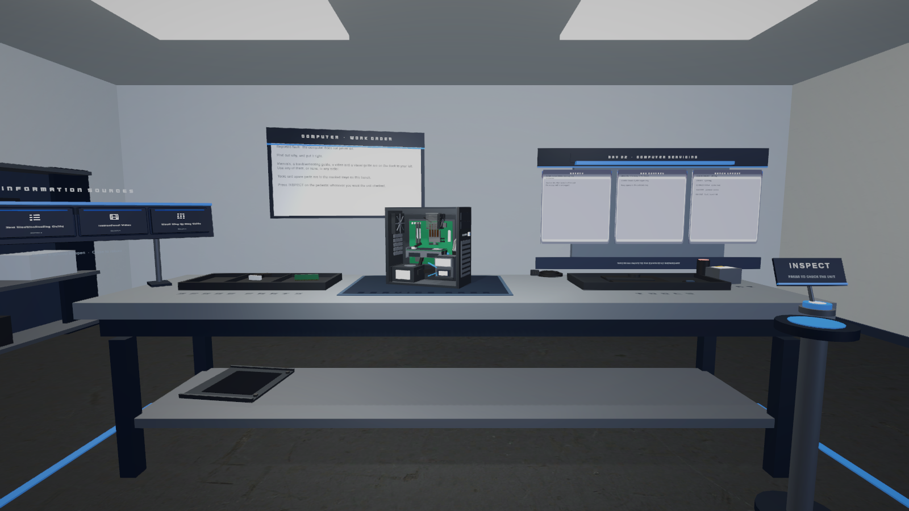
*Computer bench, from where the participant starts. The tower is open toward them; the
spares tray is on the left and holds one part.*

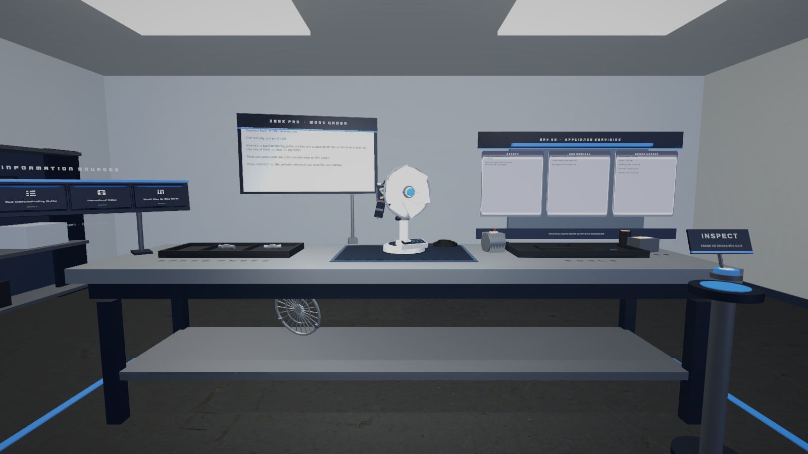
*Fan bench, from the same standing position. The 31 mm spare fuse is in the left-hand
tray — at 0.63° wide it is close to invisible at this distance, which is the point ก is
asking about.*

Plan views of the same two benches: `Screenshots/Audit/After_Computer_Overview.png` and
`Screenshots/Audit/After_Fan_Overview.png`.

### Closed question ก

> **Do you accept the current positions and sizes of all 31 parts, as tabled above, as
> the layout used for data collection?**
> If **no**, name which parts must move or change size and the review will be re-run.

---

## 3. ข — Both benches were re-framed from "assemble this" to "diagnose this"

### What changed

Before `de7d5fd`, both benches presented a machine with its parts spread out around it.
Fresh readers looking at that consistently described the task as *build this machine*.
The re-framing put the machines back together, opened them for service, and **took the
surplus parts off the bench**:

**Computer bench.** `computer.ram` — a spare memory module that had been lying in the
spares tray on an antistatic pad — is now **seated in the board's fourth memory slot**.
The tray keeps exactly one part, the replacement 24-pin power lead. The tool tray keeps
one screwdriver. `computer.non-target-module` is **stowed**. The antistatic pad is gone.
The lower shelf is captioned, so the removed side panel reads as *removed* rather than
*not yet fitted*. The work order gained one sentence, in all three languages: *the unit
is assembled and open for service*.

**Fan bench.** One assembled fan, one open service bay, one fuse fitted in the holder,
one spare fuse in the tray, one tool. **Stowed:** the second loose fuse
(`fan.faulty-fuse`), the spare motor (`fan.motor-module`), and `fan.non-target-module`.
The mains plug used to stand 0.32 m clear of its own coil, reading as two more parts
waiting to be fitted; it now sits at the coil's edge. The bench mat caption used to read
*INSTALLED COMPONENT*, which named the whole machine a component.

Nothing was deleted. A stowed part keeps its object id and its settings; switching it
back on restores it exactly, and re-running the builder refreshes it first.

### Which commit

`de7d5fd`, "Frame both benches as diagnosis, and fix the invisible wall board".

The same commit fixed a separate defect found while measuring: the four notice cards on
the lab wall had always rendered as **blank white rectangles**. Their text was present
and correctly referenced, but each card's opaque front face sat 9 mm nearer the eye than
its own lettering, so the lettering was discarded. The cards also only ever carried a
heading, with no body text underneath. Both are fixed; the copy is lab procedure only
and names neither fault, because the board can be read from anywhere in the room.

### Why

The measured variable is *how a person diagnoses a fault*. A bench that reads as an
assembly job asks a different question, and it asks it of both conditions at once.

### What was not chosen

1. **Leaving both benches as they were and correcting the framing in the spoken
   briefing.** Rejected: the briefing is read once and the bench is looked at for the
   whole task; where the two disagree, the bench wins.
2. **Deleting the surplus parts outright.** Rejected: stowing keeps the object ids in the
   scene, so the change is reversible in one step and the data schema is untouched.
3. **Keeping `computer.ram` in the tray and adding a second distractor to the fan bench
   to match.** Rejected here because adding a part to the fan bench changes the number of
   objects the participant sees, which is a protocol change and yours to make — see §4,
   which is exactly this question put to you directly.

### What this does to the research

* Both conditions now pose the same kind of question, which is the point.
* The number of parts on each bench dropped. Fewer parts means fewer things to
  investigate, which shortens the search and reduces the number of recorded interactions
  per task in both conditions.
* `computer.ram` changed meaning without changing its id or its recorded event type.
  Selecting it still records an incorrect-component action — but that now means *pulling
  the memory out of a machine that will not power on*, which is a real misdiagnosis,
  rather than *picking the wrong spare off a tray*. This makes the event more meaningful,
  and it also makes it the **only** such event available on either bench (§4).

### Pictures

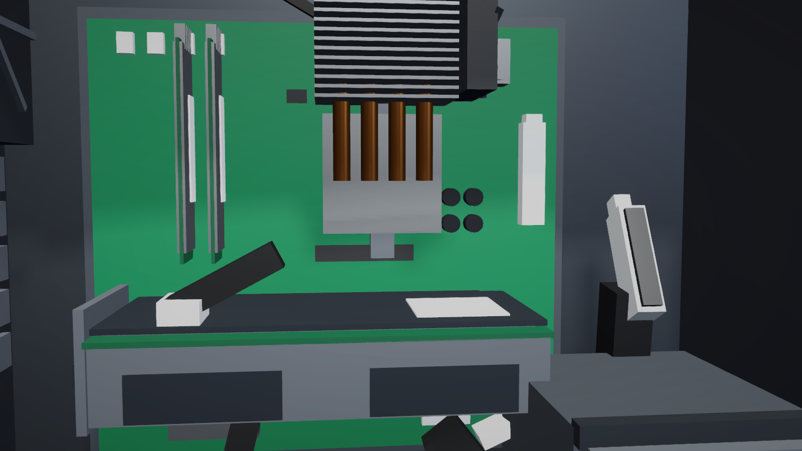
*`computer.ram` is now seated in the board's fourth memory slot instead of lying in the
spares tray. Same object, same id, same recorded event — but selecting it now means
pulling the memory out of a machine that will not power on.*

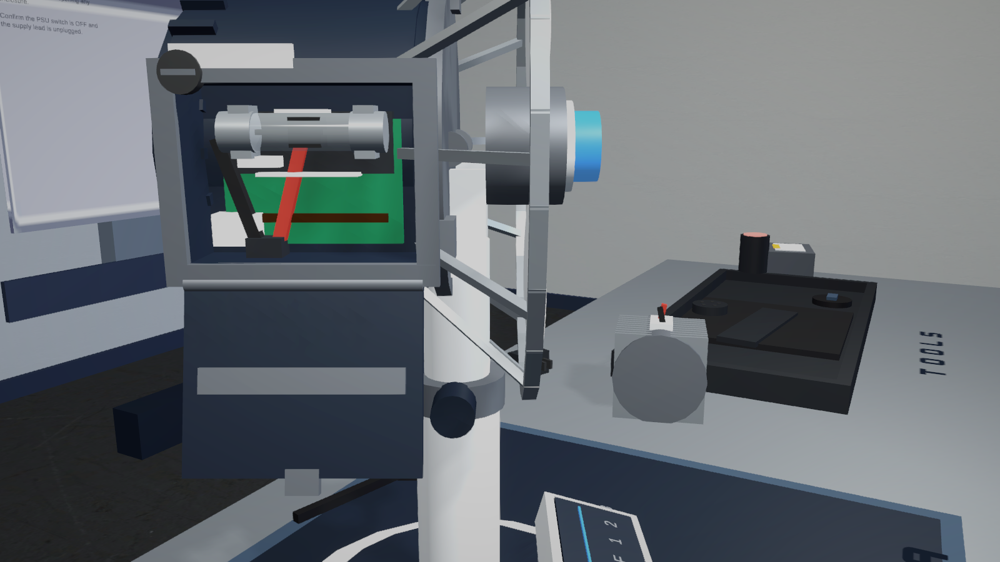
*The fan's service bay: one fuse fitted in the holder. The second loose fuse is stowed,
which is what §4 is about.*

Both benches after re-framing: `Screenshots/Audit/After_Computer_Workstation.png`,
`Screenshots/Audit/After_Fan_Workstation.png`. The repaired wall notice board:
`Screenshots/Audit/After_Training_Workstation.png`. Full measurements:
`Verification/DIAGNOSTIC_FRAMING_RECORD.md`.

### Closed question ข

> **Do you accept diagnosis — an assembled, opened machine with only one spare and one
> tool on the bench — as the task both conditions present?**
> If **no**, the stowed parts can be switched back on in one step and the previous
> arrangement restored.

---

## 4. ค — The fan bench cannot record a wrong-part action at all; the computer bench can

This is the most consequential asymmetry in the current build, and it is a direct and
acknowledged cost of §3.

### The mechanism, precisely

The software records a wrong-part action — event type `IncorrectComponentInteraction` —
in exactly one circumstance: the participant selects a part that is marked as a *repair
action* and is **not** the repair the task requires. That is the only route to that
event. It is not produced by grabbing, hovering, or touching anything else.

Each bench's repair-action parts, as they stand today:

| Bench | Repair-action parts present | Correct one | Wrong one available? |
|---|---|---|---|
| Computer | `computer.main-power-connector`, `computer.ram` | `computer.main-power-connector` | **Yes** — `computer.ram`, active and on the board |
| Fan | `fan.working-fuse` only | `fan.working-fuse` | **No** — `fan.faulty-fuse` is stowed |

There is a second, separate asymmetry that goes the other way and cancels nothing:

| Bench | Tools present | Any wrong tool? |
|---|---|---|
| Computer | one screwdriver, marked correct | **No** |
| Fan | one screwdriver, marked correct | **No** |

So `IncorrectToolSelected` is structurally impossible on **both** benches. The only
failure route both benches share is a failed device test.

### Which commit

`de7d5fd`. The commit message states the cost explicitly: *"fan.faulty-fuse was that
scene's only repair action besides the correct one, so the fan task can no longer record
an incorrect repair. That is the direct cost of one installed fuse and one spare."*

### Exactly which columns of `task_summary.csv` this affects

| Column | Computer task | Fan task | Consequence |
|---|---|---|---|
| `incorrect_component_interaction_count` | Can be 0 or more | **Always 0** | Not comparable between conditions. Any between-condition test on this column measures the bench layout, not the participant. |
| `incorrect_tool_selected_count` | **Always 0** | **Always 0** | Dead column in this build. Safe to compare — both are structurally zero — but it carries no information. |
| `unsuccessful_action_count` | Wrong repair **or** failed device test | **Failed device test only** | The same number means different things on the two benches. On the fan task it is a count of failed device tests; on the computer task it is failed device tests **plus** wrong-part selections. |
| `device_test_failed_count` | Available | Available | Comparable. This is the only failure count that means the same thing on both benches. |
| `returned_to_information_after_unsuccessful_action` | Triggered by a wrong repair or a failed test | Triggered **only** by a failed test | The trigger differs, so the two conditions are answering slightly different questions. |
| `first_meaningful_action`, `first_meaningful_action_timestamp_seconds` | A wrong repair can be the first meaningful action | It cannot | A small bias in which action gets recorded first. |

`unsuccessful_action_count` is the one that will silently mislead, because it is a single
number that looks comparable and is not.

### What was not chosen

1. **Switching `fan.faulty-fuse` back on.** This restores symmetry in one step, but puts a
   second loose fuse back on a bench that §3 deliberately cleared, and re-opens the "is
   this an assembly task" reading. It is one of the two things you can choose.
2. **Stowing `computer.ram` to match the fan bench.** This makes both conditions
   symmetrical at zero — no wrong-part action is possible anywhere. The columns become
   dead but honest. It also removes the most realistic misdiagnosis in the study.
3. **Adding a wrong tool to both benches.** Rejected without asking: it adds an object to
   both benches, which is a protocol change.
4. **Doing nothing and handling it in analysis.** Possible — the columns are separable —
   but it must be a decision on record before data collection, not a discovery
   afterwards.

### What this does to the research

If nothing changes: any hypothesis about error rates must be tested **within** a
condition, not across the two, and `unsuccessful_action_count` must be decomposed into
its parts before use. That is a real constraint on what the study can claim, so it needs
to be a decision rather than a footnote.

### Pictures

The comparison the fan participant no longer gets to make on the bench:

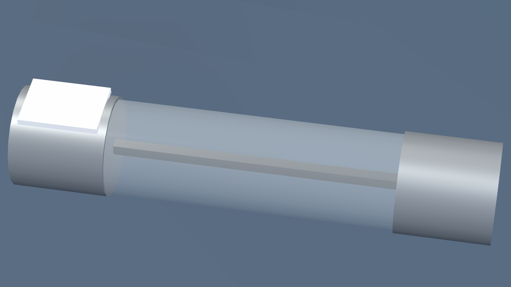
*The working fuse: a continuous 0.7 mm element across the glass.*

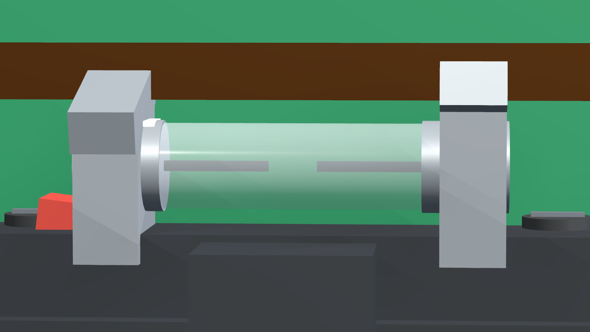
*The blown fuse: the same glass, the same ferrules, the same printed rating — the
element has parted, and that is the only difference. This fuse is currently **stowed**,
so the participant never has two cartridges to compare; the only blown one is the one
fitted in the holder.*

Whether that 0.7 mm element is even visible on the headset is an open hardware question
— `QUEST3_NEXT_STEPS.md`, check 4.

### Closed question ค

> **Do you accept that a wrong-part action can only ever be recorded on the computer
> task, and never on the fan task?**
> If **no**, state which: switch `fan.faulty-fuse` back on (symmetry at two), or stow
> `computer.ram` (symmetry at zero). Either is a one-step change and neither touches an
> object id or a data column.

---

## 5. ง — The part that is the answer to the computer task was rotated 44°

### What changed

`computer.internal-cable` is the 24-pin power plug hanging unplugged inside the machine.
It **is** the fault in the computer task: the whole of that task is noticing that this
plug is not in the socket it belongs to.

Its lean changed from **−18° to +26°** — a 44° rotation. Its position, its size, its
click target, its object id and its recorded event type are all unchanged.

### Which commit

`0248328`, "Make the parts a participant has to name look like the parts they are".

### Why

At −18° the plug leaned *into* the machine, so a participant standing at the open side
saw its blank white back. At +26° it leans *out*, so the two rows of twelve bores — the
thing that makes it recognisable as a power plug, and matches the spare in the tray —
face the person looking at it. The socket it belongs in opens toward the same side, so a
lead pulled out of it and left hanging would in reality point up at its own socket.

### What was not chosen

1. **Marking the fault** — a glow, a colour, an arrow, a wider gap. Rejected outright:
   the task is finding it. Nothing about this plug is brighter, larger or differently
   coloured than the identical spare lying in the tray.
2. **Moving the plug somewhere more visible.** Rejected: that would change how far the
   participant has to travel and where they have to look, which is measured. Only the
   rotation changed.
3. **Leaving it at −18°.** Rejected because a participant who cannot tell what the object
   is cannot form a hypothesis about it, and would fall back on either poking things or
   opening a manual — and *which of those they do* is one of the study's outcomes.

### What this does to the research

This moves the answer's visibility without moving the answer. It should make the fault
findable by looking, which is the intended path, and correspondingly reduce the number
of participants who find it by exhaustive poking or by reading a manual first. Since the
split between *look*, *poke* and *read* is an outcome, this rotation shifts an outcome
distribution. It is small and deliberate, but it is not neutral.

**It has not been tested with a person.** No participant has looked at either version.

### Pictures

This is the item where looking is much faster than reading. Both images are the same
camera position; only the plug's lean differs.

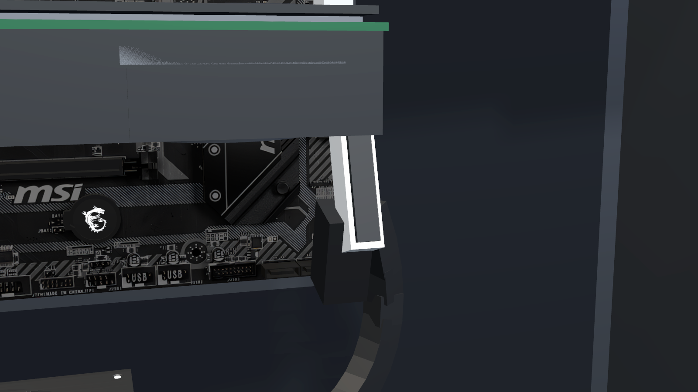
*Before, at −18°: the plug leans into the machine and shows the participant its blank
white back. Nothing about it says "power connector".*

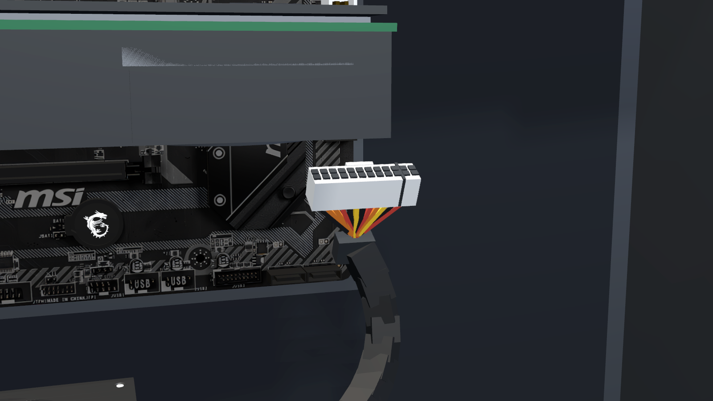
*After, at +26°: the same plug in the same place, turned so its two rows of twelve bores
face the person looking in. It is now recognisably the mate of the spare in the tray.*

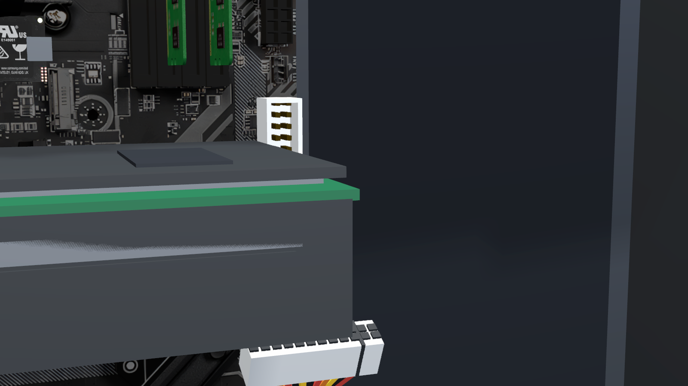
*The socket on the board that the plug should be in. The task is noticing that these two
are not joined.*

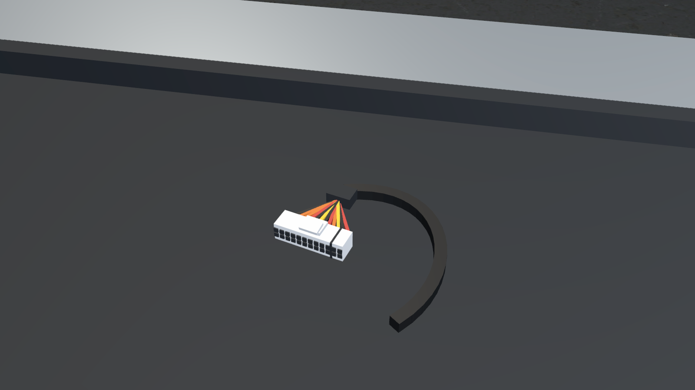
*The spare in the tray — same body, same size, same rail colours. Nothing marks either
one as the answer.*

The same pair from the start pose, before stepping in:
`Screenshots/Recognition/Before_Computer_AtxFault_StartPose.png` and
`Screenshots/Recognition/After_Computer_AtxFault_StartPose.png`.

### Closed question ง

> **Do you accept the fault plug being turned so that its bores face the participant's
> approach, rather than facing away?**
> If **no**, the rotation reverts to −18° in one line and both benches rebuild.

---

## 6. จ — The two device-test controls no longer look alike

### What changed

Every task ends the same way: the participant operates the machine's own control to see
whether the repair worked. Both conditions used to use **the same shape** — three
stacked cylinders with a 120 mm disc on top — so the final step looked identical in the
two conditions.

They are now two different real controls:

| Condition | Object id | Control now | Fitted size |
|---|---|---|---|
| Computer | `computer.power-button` | An industrial **push button** — plate and mushroom head | 111 × 100 × 111 mm |
| Fan | `fan.speed-selector` | A rotary **dial** — plate and knob | 125 × 90 × 125 mm |

A third control changed at the same time: `fan.power-switch`, the switch on the fan's
base, is now a **slider** with a handle in a travel slot.

All three keep their object ids, their click targets, their recorded event types and
their positions. Both device-test controls stand on the same pedestal at the same place,
(1.50, 0.95, 0.20), and both carry the same sign: **INSPECT / PRESS TO CHECK THE UNIT**.

### Which commit

`0248328`.

### Why

The parts were sized from the real components they represent, and a computer's power
button and a fan's speed control are not the same object. A fan whose only control is a
push button does not read as a fan.

### What was not chosen

1. **Giving both conditions the push button.** Rejected: it is the honest control for the
   computer and the wrong one for the fan, so it would make one condition less realistic
   in exactly the way the recognition pass was trying to fix.
2. **Giving both conditions the dial.** Same objection, reversed.
3. **Keeping the old three-cylinder shape in both.** Rejected: neither condition could
   name it, so in both conditions the last step was "operate the unidentifiable thing".

### What this does to the research

The two conditions now differ in the **motor action** of the final step: pressing versus
turning. A press is a single, familiar, low-precision action. A turn requires grip and
rotation and is more sensitive to controller tracking and to hand size. If the fan task
turns out to have systematically longer completion times or more device-test attempts,
this difference is a candidate explanation and cannot be separated from it after the
fact.

The sign above both controls is identical, and the wording says what to do without
naming what to fix, so the *instruction* is matched even though the control is not.

**Not yet measured:** whether a dial is harder to operate than a button on the actual
headset. That is on the Quest 3 checklist (`QUEST3_NEXT_STEPS.md`, check 6).

### Pictures

The two controls that end the two tasks, side by side.

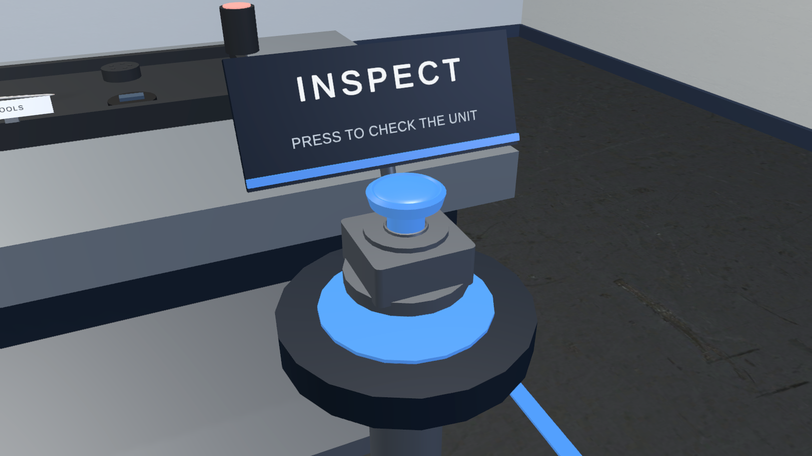
*Computer condition — a push button. The participant presses it.*

*Fan condition — a rotary dial. The participant turns it. Same pedestal, same position,
same sign; different hand action.*

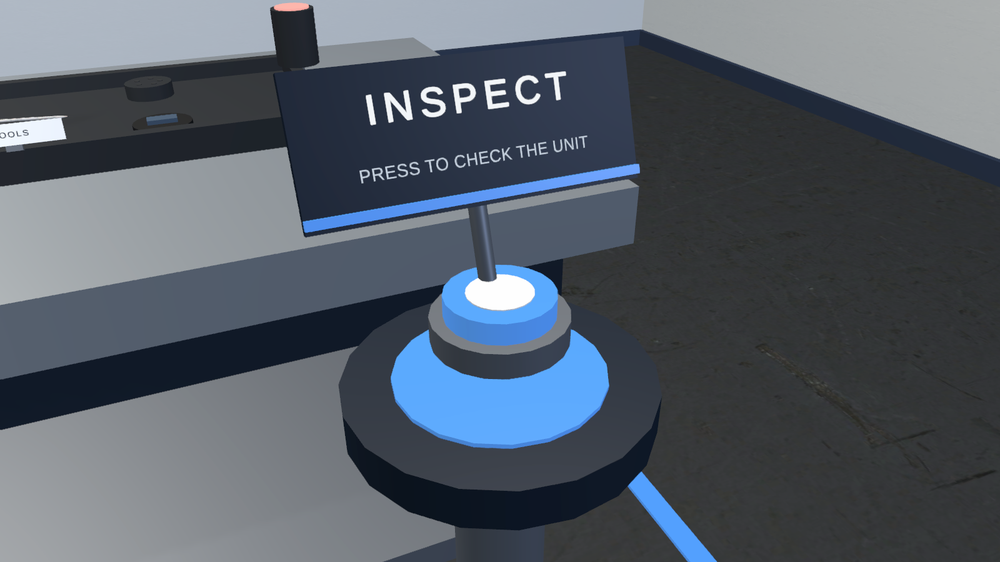
*What both used to be: three stacked cylinders under a 120 mm disc, identical in the two
conditions and nameable in neither.*

Each in place on its pedestal: `Screenshots/Audit/Approach_Computer_InspectControl.png`
and `Screenshots/Audit/Approach_Fan_InspectControl.png`.

### Closed question จ

> **Do you accept two different-looking controls — a push button in the computer
> condition, a dial in the fan condition — for the same final step?**
> If **no**, both can be set to the same shape; say which shape.

---

## 7. ฉ — Data recorded before `743b1c3` filed internal parts under the machine's name

### What happened

Both benches build their internal parts as children of the machine, so their positions
stay readable relative to it. The interaction toolkit, when a machine's own click-target
list is left empty, fills it by collecting **every click target underneath that machine,
including its children's**. The machine registers first, so a pointer aimed at anything
inside it resolved to the machine.

The result: **every hover and every selection of a part inside a machine was recorded
against the machine's object id.**

| Scene | Machine that absorbed its children | Child parts recorded as the machine |
|---|---|---|
| Computer | `computer.case` | `computer.motherboard`, `computer.psu`, `computer.psu-switch`, `computer.cooling-fan`, `computer.internal-cable`, `computer.ram` (6 parts, 7 targets in total) |
| Fan | `fan.body` | `fan.blade`, `fan.fastener`, `fan.fuse-holder`, `fan.internal-wire`, `fan.power-switch` (5 parts, 6 targets in total) |

There was one visible symptom — a single warning line when the scene loaded — and
nothing else. Both correct repair parts sit out on the bench, outside the machine, so the
repair loop always completed and every check passed.

### Which commit fixed it

`743b1c3`, "Stop the device interactables swallowing their children's colliders". Each
part's click-target list is now written explicitly to its own target, so the nesting no
longer matters. Verified at 13/13 and 15/15 parts, with no warning at scene load.

The defect **pre-dates** the diagnostic re-framing, but `de7d5fd` seating
`computer.ram` on the board added one more shadowed part to it.

### Why this matters for the data

Any recording made before `743b1c3` has, in its event rows:

* `computer.case` or `fan.body` where the participant actually touched one of the eleven
  internal parts;
* correspondingly **inflated** hover and selection counts on `computer.case` and
  `fan.body`;
* **zero or near-zero** counts for all eleven internal parts, which reads as "nobody
  looked at the fuse holder" when in fact they did.

This is not recoverable. The rows do not record which child was actually under the
pointer, so no filter or re-derivation can separate them.

### What was not chosen

Re-deriving the old sessions from movement data. Rejected: the movement file records
where the head and hands were, not what the pointer resolved to, so the mapping cannot
be reconstructed.

### What this does to the research

* Every session recorded before `743b1c3` (2026-08-04) must be treated as pilot or
  discarded for any analysis involving per-part interaction.
* **No participant data has been collected**, so at present this costs nothing. It
  matters only if any earlier development or pilot recording were later pooled in.
* Session-level columns that do not name a part — total time, information source usage,
  low-activity periods, completion status — are unaffected.

### Closed question ฉ

> **Do you accept that no session recorded before `743b1c3` (2026-08-04) may be pooled
> with sessions recorded after it, for any analysis that names an individual part?**
> If **no**, say what recovery you expect; the data needed for it is not in the files.

---

## 8. ช — Pointing at a part often selects a different part

**Found on 2026-08-08 while preparing this package. Not previously reported. Not fixed.**

### What was measured

A pointer ray was cast from the participant's eye to the centre of what each part
actually draws — that is, the participant points straight at the part they can see — and
the software was asked which part it decided had been pointed at. Two standing poses were
used: where the participant starts, and leaning in over the bench.

**31 of 54 aims resolved to a different part.**

Full output: `Verification/Ray_Aim_Attribution.txt`. It is reproducible from the menu:
*Tools → VR Maintenance Research → Visual Audit → Report Ray Aim Attribution*.

| Scene | Aims tested | Resolved to a different part |
|---|---|---|
| Computer bench | 24 | 14 |
| Fan bench | 24 | 17 |
| Training room | 6 | **0** |

### Why

Eleven parts carry the **default click target of a Unity capsule shape: 1 000 mm across
and 2 000 mm tall**, at a bench where the parts themselves are between 11 mm and 571 mm.
The builders resize click targets through one helper, and that helper only handles box
shapes — it returns without doing anything when the shape is a capsule. So every part
built from a capsule kept a target the size of a person while its visible body was
rebuilt at true scale.

The eleven: `computer.cooling-fan`, `computer.external-power-cable`,
`computer.tool.screwdriver`, `fan.blade`, `fan.body`, `fan.fastener`, `fan.front-cover`,
`fan.internal-wire`, `fan.motor-module`, `fan.power-cord`, `fan.tool.screwdriver`.

Two of them sit in front of everything else and absorb almost all of it:
`computer.cooling-fan` takes **every** misdirected aim on the computer bench, and
`fan.blade` takes fifteen of the seventeen on the fan bench.

### The parts that cannot be aimed at

| Part | Resolves to | Why it matters |
|---|---|---|
| `computer.internal-cable` | `computer.cooling-fan` | **This is the fault in the computer task.** Pointing at it records the cooling fan. |
| `computer.ram` | `computer.cooling-fan` | The only wrong-part action in the whole study (§4) cannot be triggered by pointing at it. |
| `computer.main-power-connector` | `computer.cooling-fan` *(from the bench pose; correct from the start pose)* | **The correct repair.** Reachable from where the participant starts, not from where they will be standing when they reach for it. |
| `fan.working-fuse` | `fan.front-cover` | **The correct repair on the fan bench**, from both poses. |
| `fan.fuse-holder`, `fan.internal-wire`, `fan.power-switch`, `fan.power-plug`, `fan.body`, `fan.fastener` | `fan.blade` | The entire fan service bay resolves to the blade. |
| `computer.motherboard`, `computer.psu`, `computer.psu-switch`, `computer.case`, `computer.side-panel` | `computer.cooling-fan` | The whole computer interior resolves to the cooling fan. |

### Why no existing check caught it

Every check in the project reaches a part by name or by reference and never points at
anything:

* the scene-integrity tests read settings on components;
* the visual validator reads appearance;
* the play-mode runtime checks and the full-flow walkthroughs call the task controller's
  record-interaction method **directly**, passing the object they looked up by id.

So the repair loop has been verified at the level of *"if this part is selected, the
right thing happens"* — which is true — and never at the level of *"if the participant
points at this part, this part is selected"*, which is what fails. `743b1c3` fixed which
target belongs to which part; it did not change how big the targets are.

### What has **not** been done

The click targets have **not** been resized. Resizing them changes which object id lands
in the event stream for a given pointing action, which changes what the data means. That
is a research decision, and this package does not make research decisions.

The fix itself is small and reversible: the resize helper in the two bench builders is
extended to handle capsule shapes as well as box shapes, then both benches are rebuilt.
Every object id, event type and data column stays exactly as it is; only the size of
eleven invisible shapes changes. The report above is the before/after measurement.

### What this does to the research if it is left as it is

Per-part interaction data from both benches would be close to meaningless:
`computer.cooling-fan` and `fan.blade` would absorb most hovers and selections, and the
parts the participant was actually investigating would show near-zero counts —
the same failure mode as §7, from a different cause, and this time still live.

More seriously, the **fan task may not be completable by pointing**: `fan.working-fuse`
is the required repair and resolves to `fan.front-cover` from both tested poses. There
may be a pose from which it is reachable; that has not been established, and no person
has tried it.

### Closed question ช

> **Should the eleven oversized click targets be resized to match their parts, before any
> participant session?**
> A **yes** is a one-line change in each of the two bench builders, followed by a rebuild
> and a full re-verification. Object ids, event types, data columns and the number of
> parts on each bench are untouched.
> A **no** means per-part interaction counts are not usable in the analysis and the fan
> task's completability must be confirmed on the headset first.

---

## 9. ซ — The four information sources moved, and their order is now fixed

### What changed

The study's independent variable is **which kind of information source a participant
chooses**. Where those four sources sit, and in what order, therefore sits directly on
top of the thing being measured.

On 2026-08-02 the four sources were a row of large cards on the back wall, spread
symmetrically to the participant's left **and** right. They are now a single row of small
cards on a dock at the participant's **left only**, angled toward them.

| Measure | 2026-08-02 | Now |
|---|---|---|
| Position | Back wall, x = −3.3 / −1.1 / +1.1 / +3.3, z = 3.0 | Left-hand dock, (−2.12, 1.30, 0.30) → (−1.43, 1.30, 0.84), angled 38° toward the participant |
| Card width | 1.2 m | 0.244 m |
| Distance from the start pose | 4.73 m (inner) to 5.66 m (outer) | **2.80 m to 2.85 m** |
| Farthest : nearest distance | 1.197 | **1.018** |
| Apparent width | 14.5° (inner), 12.1° (outer) | **4.9°–5.0°, all four** |
| Spread across the body | Left and right, symmetric | **All four on the left** |
| Order | Fixed | Fixed |

### Which commit

`4f4e452` (2026-08-03), refined in `22c7158`. The stated reason: the four cards used to
sit in a grid on the bench's back edge directly over the spare-parts tray, and an opened
reader covered the left third of the bench.

### Why

The dock keeps the sources off the bench, so an opened reader can never cover the parts
the participant is diagnosing, and the dock cannot grow back over the bench.

### What this does to the research — two separate effects

**1. The four sources are now almost perfectly equal in salience.** Distance varies by
1.8% across the four and apparent width by 2%. For a study whose independent variable is
source type, that is close to ideal: no source is nearer, larger or easier to reach than
another. This is a **larger** improvement than the one the 2026-08-02 package flagged as
worth approving, and it moves in the same direction.

**2. Position in the row is completely confounded with source type.** The dock builds
the row by sorting on source type, so the order is always:

> **manual → troubleshooting guide → video → visual guide**

left to right, in both tasks, for every participant. There is one layout identifier in
the build, `sources-layout-development-a`, and no second layout exists. So:

* the manual is always the source at one end of the row and the visual guide always at
  the other;
* any tendency to reach for the nearest end, or to read a row left to right, adds a
  constant bias to the same source type in every session;
* `information_source_layout_id` records the layout faithfully — it will simply record
  the same value for every participant, so the bias cannot be modelled out afterwards.

The protocol log already lists a "source-layout assignment schedule" as a document to
produce before data collection. Nothing in the build implements one.

### What was not chosen

1. **Randomising or counterbalancing the row order per participant.** Not done, because
   it is a protocol decision and would need an assignment schedule and a second layout
   identifier so the data can say which participant saw which order.
2. **Putting the sources back on the back wall.** That restores left/right symmetry but
   also restores the unequal distances the 2026-08-02 package flagged, and puts the
   opened reader back over the bench.
3. **Splitting the four across both sides of the participant.** Would restore symmetry
   without the reader problem, but doubles the fixture and makes two of the four
   invisible without a head turn.

### Closed question ซ

> **Do you accept a fixed left-to-right order — manual, troubleshooting, video, visual
> guide — identical in both tasks and for every participant?**
> If **no**, a counterbalanced order needs an assignment schedule from you and a distinct
> `information_source_layout_id` per order, so the data records which one each
> participant saw.

---

## 10. Where the 2026-08-02 decisions now stand

| # | 2026-08-02 item | State today |
|---|---|---|
| 1 | Researcher-panel key crashed the software every frame | **Fixed.** All three scenes now store the correct key value and the code corrects a wrong one on load. |
| 2 | First-action metric fires ~14 ms into every task from an incidental pointer hover | **Still open.** Unchanged. Still needs your decision on whether a hover counts as a meaningful action. |
| 3 | Participant start pose, 2.05 m from the bench | **Still open**, and now folded into ก. |
| 4 | Information-source salience became more equal | **Superseded by ซ.** The tiles did not stay where that package left them — they moved to a left-hand dock on 2026-08-03 and are now near-identical in distance and apparent size. §9 has the current numbers and a new question about their fixed order. |
| 5 | Target size | **Superseded by ก**, which has the current numbers. Targets are smaller again. |
| 6 | Fan fuse initial state — both fuses loose in the tray | **Changed by `de7d5fd`, and now folded into ค.** One fuse is fitted in the holder; the other is stowed. |
| 7 | Movement file's frame label says `task-local` but records world coordinates | **Still open.** Unchanged. |
| 8 | The same hover is recorded twice when both controllers point at one object | **Still open.** Unchanged. |
| 9 | A hand-driven completed run outside the editor | **Done** — `6845fec` drove a whole session end to end with development mode off, both task orders. |
| 10 | Physical Quest 3 validation | **Still outstanding.** A Quest 3 build was produced (`b152597`) but never installed and never run. See `QUEST3_NEXT_STEPS.md`. |

Two further changes from rounds 4 and 5 need recording but do not need a decision:

* **`50ad6fa`** — the researcher's mouse could write into the participant's data. The
  deployment is a PC running Quest Link, so the game view sits on the researcher's
  monitor while the participant works; a mouse click over a part recorded a hover, a grab
  or an information-source open in the participant's event stream. That path is now off
  during a participant session. Rows already affected are identifiable: they carry
  `interactor=mouse`.
* **`a32041c`** — the participant removes the headset between the two tasks for
  NASA-TLX. A *Continue* button on the participant's status board would have let them
  load the second task before that questionnaire was administered. The board now carries
  no control at all and shows a finished notice in the participant's own language.
  Advancing is the researcher's, from the desktop panel. The session also no longer ends
  by loading the setup screen, which had no head tracking and displayed the participant
  code.

---

## 11. Answer sheet

Nothing below has been filled in. Tick or write in the right-hand column.

| # | Question | Yes | No | If no, what instead |
|---|---|---|---|---|
| ก | Accept the current positions and sizes of all 31 parts? | ☐ | ☐ | |
| ข | Accept diagnosis, with fewer parts on the bench, as the task? | ☐ | ☐ | |
| ค | Accept that a wrong-part action is only recordable on the computer task? | ☐ | ☐ | |
| ง | Accept the fault plug turned to face the participant's approach? | ☐ | ☐ | |
| จ | Accept a push button in one condition and a dial in the other? | ☐ | ☐ | |
| ฉ | Accept that pre-`743b1c3` sessions cannot be pooled with later ones? | ☐ | ☐ | |
| ช | Resize the eleven oversized click targets before any participant session? | ☐ | ☐ | |
| ซ | Accept a fixed source order — manual, troubleshooting, video, visual guide — for every participant? | ☐ | ☐ | |
| — | Carried over: does an incidental pointer hover count as a meaningful action? | ☐ | ☐ | |
| — | Carried over: correct the movement file's frame label to `world`? | ☐ | ☐ | |
| — | Carried over: should a two-controller hover of one object record one event or two? | ☐ | ☐ | |
| — | Carried over: approve the participant start pose, 2.05 m from the bench? | ☐ | ☐ | |

---

## 12. What was verified for this package, and what was not

**Verified, in the editor, on 2026-08-08 at commit `0248328`:**

| Check | Result |
|---|---|
| Scene integrity, 7 tests | 7/7 pass — `Verification/Scene_Integrity_Tests.txt` |
| Scene validator, 4 scenes | All pass, no warnings — `Verification/VisualAudit_Validation.txt` |
| Foundation tests, 6 tests | 6/6 pass |
| Repair loop, both benches | Fail → repair → pass → reset — `Verification/Runtime_Checks_*.txt` |
| Training checks | Pass |
| Full session, both task orders | Pass — `Verification/Full_Flow_Walkthrough_*.txt` |
| Object ids | All 31 byte-identical to the baseline |
| Console | No errors |
| Pointer attribution | **31 of 54 aims resolve to a different part** — `Verification/Ray_Aim_Attribution.txt` (§8) |

**Not verified, and not claimed anywhere in this document:**

* Anything on a physical Meta Quest 3. A build exists; it has never been installed or
  run. No frame rate, comfort, legibility or tracking claim is made.
* Whether any of these changes helps a real participant. No person has been through any
  version of either bench.
* Whether the Thai and Japanese wording is correct. It has never been checked by a
  reader of either language — see `TRANSLATION_REVIEW.md`.
